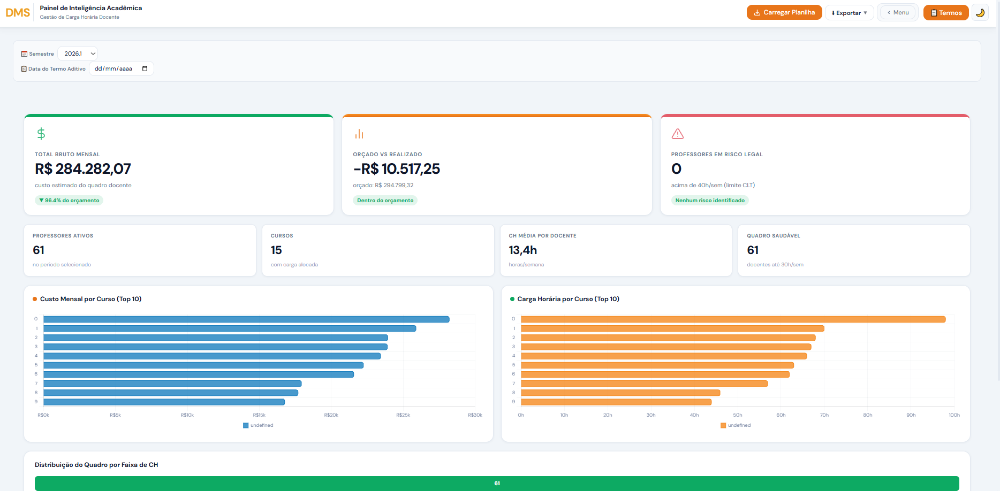

# DMS Dashboard

Painel web para gestão de carga horária (CH) e folha docente de Instituições de Ensino Superior (IES) — do upload da planilha até a análise executiva, operacional e orçamentária, tudo processado no navegador.




## 🎯 Sobre o projeto

Instituições de ensino com muitos professores e cursos costumam controlar carga horária e custo de folha docente em planilhas soltas, sem visão consolidada. O **DMS Dashboard** parte de uma única planilha `.xlsx` (o formato que a maioria das secretarias acadêmicas já usa no dia a dia) e transforma esses dados em três visões prontas para decisão: uma para gestão executiva, uma para análise operacional detalhada e uma para acompanhamento orçamentário.

O projeto nasceu de uma necessidade real observada durante minha atuação em uma instituição de ensino, e essa versão pública foi reconstruída e descaracterizada especificamente para portfólio (mais detalhes em [Dados](#-dados)).

## 💼 Problema

Calcular CH e custo de folha docente exige aplicar várias regras ao mesmo tempo: diferenciar horas de ensino, coordenação e atividades como orientação de TCC; converter carga semanal em mensal; aplicar DSR e horas de atividade; identificar quem está acima do limite legal de carga horária. Feito manualmente em planilha, isso é lento, sujeito a erro e difícil de repetir a cada novo semestre — e ainda mais difícil de comparar orçado vs. realizado sem retrabalho.

## 💡 Solução

O DMS lê a planilha, aplica as regras de negócio uma única vez e gera automaticamente KPIs, alertas, rankings, gráficos e exportações — sem precisar reconstruir nada a cada carregamento. A pessoa usuária importa o arquivo e navega entre três visões (Executivo, Operacional, Orçamento) conforme o nível de detalhe que precisa naquele momento.

## 📊 Principais funcionalidades

**Análise executiva**
- KPIs consolidados (custo total, CH média, quadro saudável vs. em risco)
- Gráficos de custo e CH por curso

**Análise operacional**
- 7 gráficos comparativos (por curso, por professor, por tipo de hora, por escola, custo total, distribuição, faixas de CH)
- Heatmap professor × curso
- Gauge de ocupação docente
- Linha do tempo de evolução de CH por período
- Índice de Gini para medir concentração/desigualdade de carga entre docentes
- Rankings automáticos com drill-down

**Orçamento**
- Comparativo Orçado vs. Realizado, em R$ e em horas (CH)
- Desvio por curso com status visual

**Cálculos e regras de negócio**
- Cálculo de custo docente (Base + DSR + Horas de Atividade) a partir de CH e valor da hora-aula
- Classificação automática de horas (ensino, coordenação, eventos como TCC/estágio)
- Alertas de professores acima do limite legal de carga horária (40h/semana), com destaque para situações críticas (≥50h)

**Importação e exportação**
- Upload por clique ou arrastar-e-soltar, com leitura em lotes (chunks) para não travar a interface em planilhas grandes
- Exportação em PDF (relatório executivo e Termos Aditivos individuais/em lote), Excel e CSV
- Geração de Termos Aditivos com cruzamento automático de CPF a partir de uma aba auxiliar

## 🖥️ Demonstração

<!--
  Sugestões de screenshots/GIF, nesta ordem:
  1. Tela Executivo (visão geral com KPIs e gráficos)
  2. Tela Operacional (carrossel de gráficos + heatmap)
  3. Tela Orçamento (comparativo Orçado x Realizado)
  4. Tela do Gerador de Termos Aditivos (cards de professores + CPF mapeado)
  5. Opcional: GIF curto de ~10s mostrando upload → troca entre as 3 visões → exportar PDF
-->

🔗 Link para demonstração ao vivo: *(adicionar aqui após publicar via GitHub Pages)*

## 🏗️ Como funciona

```
Planilha .xlsx (upload)
        ↓
Leitura em chunks (SheetJS)
        ↓
Regras de negócio (CH, custo, classificação de horas, limite legal)
        ↓
Análises (KPIs, Gini, heatmap, alertas, rankings)
        ↓
Visualizações (Chart.js) — Executivo / Operacional / Orçamento
        ↓
Exportações (PDF, Excel, CSV, Termos Aditivos)
```

## 🧠 Principais decisões técnicas

- **Organização em módulos nomeados dentro de arquivos únicos**: tanto `app.js` quanto `style.css` são divididos internamente em blocos com cabeçalho `MODULE:` (ex.: `alertEngine`, `heatmapEngine`, `gaugeEngine`, `rankingEngine`, `export-pdf`), mesmo sem um bundler — facilita localizar e alterar uma funcionalidade sem precisar caçar código espalhado.
- **Processamento em lotes (chunks) na leitura da planilha**: arquivos grandes são lidos em blocos de 200 linhas em vez de tudo de uma vez, liberando a interface entre cada lote para não travar a tela durante o carregamento.
- **Renderização defensiva**: cada função de gráfico/painel roda dentro de um wrapper (`_safeCall`) que captura erros individualmente — se um gráfico específico falhar, o restante do dashboard continua funcionando em vez de quebrar a página inteira.
- **Regras de negócio explícitas e testáveis**: classificação de tipo de hora (ensino/coordenação/evento) e o limite legal de 40h/semana são centralizados em funções próprias, não espalhados em condicionais soltas pela interface.
- **Processamento 100% local**: a leitura da planilha e todos os cálculos acontecem no navegador da própria pessoa usuária — nenhum dado é enviado a servidor.

## 🛠️ Tecnologias utilizadas

**Frontend**
HTML5 · CSS3 · JavaScript (vanilla, sem frameworks)

**Processamento de dados**
[SheetJS (xlsx)](https://sheetjs.com/) — leitura de planilhas `.xlsx` no navegador

**Visualização**
[Chart.js](https://www.chartjs.org/) — gráficos de barra, doughnut e linha · Canvas 2D nativo — gauges semicirculares desenhados manualmente

**Exportação**
[jsPDF](https://github.com/parallax/jsPDF) + [html2canvas](https://html2canvas.hertzen.com/) — geração de relatórios e Termos Aditivos em PDF

## 📁 Estrutura do projeto

```
dms-dashboard/
├── index.html                              # estrutura da página
├── css/
│   └── style.css                           # estilos, organizados em módulos internos
├── js/
│   └── app.js                              # lógica da aplicação, organizada em módulos internos
├── dados-exemplo/
│   └── planilha-modelo-portfolio.xlsx      # planilha fictícia para testar o painel
└── README.md
```

## 🚀 Como executar

Não há dependências, instalação nem build — é uma aplicação estática.

```bash
git clone https://github.com/diegomoreira0997-ops/dms-dashboard.git
cd dms-dashboard
```

Depois, é só abrir o `index.html` no navegador (duplo clique ou "Abrir com" o navegador de sua preferência) e carregar a planilha `dados-exemplo/planilha-modelo-portfolio.xlsx` — ou arrastar o arquivo direto para a tela inicial.

## 📚 O que este projeto demonstra

- Tradução de um problema operacional real em regras de negócio explícitas e testáveis
- Manipulação e processamento de dados (parsing de planilhas, agregações, cálculos derivados)
- Lógica de programação aplicada a cenários com múltiplas exceções (tipos de hora, coordenação, limites legais)
- Organização de código em módulos coesos, mesmo sem framework ou bundler
- Construção de visualizações que respondem a uma pergunta de gestão (não só "exibir dados", mas apontar risco, desvio e tendência)
- Atenção a performance e resiliência (leitura em lotes, renderização defensiva)

## 🤖 Uso de IA no desenvolvimento

Ferramentas de IA (Claude, da Anthropic) foram utilizadas como apoio durante o desenvolvimento — na implementação, revisão e resolução de bugs. As decisões de requisitos, regras de negócio de carga horária e folha docente, e a validação de cada funcionalidade foram definidas e conduzidas por mim ao longo do processo.

## 🔐 Dados

Os dados em `dados-exemplo/planilha-modelo-portfolio.xlsx` são **100% fictícios**: nomes de professores, CPFs, cursos, valores de orçamento e carga horária foram gerados aleatoriamente apenas para demonstrar a ferramenta. Os CPFs, inclusive, não possuem dígito verificador válido — são só sequências numéricas de exemplo.

O projeto foi originalmente desenvolvido a partir de uma necessidade real observada em uma instituição de ensino, mas esta versão pública foi completamente descaracterizada: sem nome, logo, CNPJ ou qualquer dado que identifique a instituição de origem.

## 📌 Status

Projeto em evolução — funcionalidades e organização de código sendo revisadas e ampliadas continuamente.

## 👤 Autor

**Diego Moreira da Silva**
[LinkedIn](https://linkedin.com/in/diegos1lva) · [GitHub](https://github.com/diegomoreira0997-ops)
